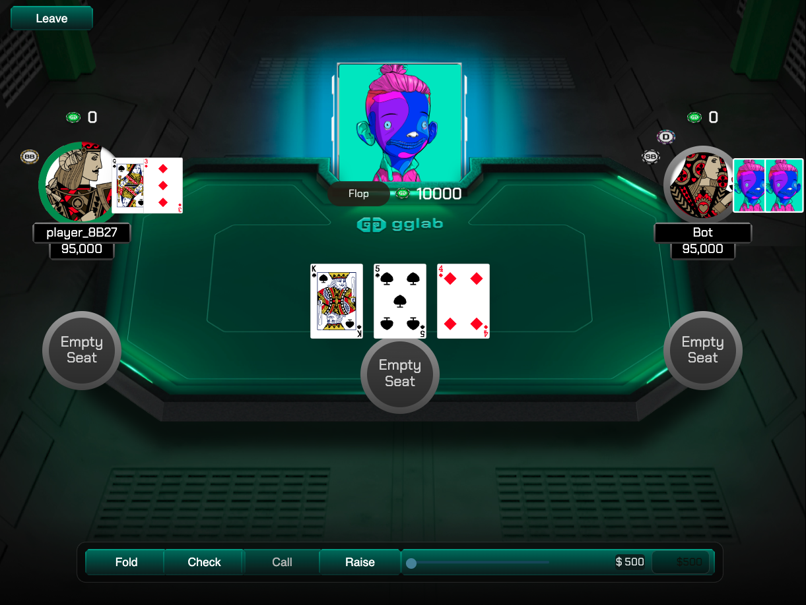

# 🃏 Bet Poker Web3 Integration – Full Refactor & Enhancements

**Author:** Jose Fernando Berna  
**Date:** October 27, 2025

---

## 📘 Project Overview

This repository represents a **complete transformation of a traditional poker web game** into a **Web3-ready dApp** using modern React patterns, WebSocket integration, and wallet connection with **WalletConnect** and **RainbowKit**.  
Originally, the project was not blockchain-enabled and had multiple architectural limitations — it required a full refactor to introduce scalability, modularization, and clear separation between game logic, network communication, and wallet authentication.

---

## 🎮 Gameplay Demo

## 🧩 Key Changes & Implementations

### 1. Web3 Integration
- Added **RainbowKit** and **Wagmi** for wallet connection (MetaMask, WalletConnect, Coinbase Wallet, etc.).  
- Implemented proper handling for **connection state** (`isConnected`, `address`, `disconnect`) with React Hooks.
- Added a **Connect Wallet screen** (`ConnectWallet.js`) with UX-friendly wallet connect and disconnect flow.

### 2. Backend Connection Fixes
- The original backend WebSocket server was not connecting properly due to CORS and auth issues.
- Implemented a **JWT guest authentication system** that automatically generates tokens via `POST /auth/guest`.
- Refactored the client to store tokens locally and reuse them on reconnection.
- Added reconnection and error-handling logic for unstable WebSocket states.

### 3. Game Flow Refactor
- **Original issue:** Connecting the wallet jumped directly into the table view, skipping the lobby.
- **Fix:** Separated routing flow into clear steps:
  1. `ConnectWallet` → Authenticates and connects to socket.
  2. `Lobby` → Displays available tables, with real-time updates.
  3. `Play` → Joins the selected table and renders seats, board, actions, and round states.
- Introduced **`joinedRef`** and proper `selectedTableId` validation to prevent ghost joins or incorrect routing.

### 4. Improved UX & State Management
- Added a **Disconnect button** in the Lobby screen to return to the Connect screen with clean session reset.
- Managed wallet and game data through global contexts:
  - `globalContext`: Wallet address, selected table, lobby tables, players.
  - `socketContext`: Centralized WebSocket connection lifecycle.
  - `gameContext`: Player actions (`joinTable`, `leaveTable`, `fold`, `check`, `call`, `raise`, etc.).

### 5. Routing & Navigation Improvements
- Unified route flow with React Router v6, using `useNavigate()` hooks and `replace` mode to prevent backstack issues.
- Handled edge cases:
  - No wallet connected → redirect to `/`.
  - No selected table → redirect to `/lobby`.
  - Disconnected socket → reconnection event listener.

---

## 🧠 Best Practices Implemented

✅ **Component modularity:** Separated logic from UI (`Play`, `Lobby`, `ConnectWallet`).  
✅ **Context API:** Used React Contexts for global state instead of prop drilling.  
✅ **Error handling:** Graceful fallbacks for missing wallet, socket, or token.  
✅ **Hooks consistency:** Used `useEffect` dependencies correctly to avoid race conditions.  
✅ **Code readability:** Added explicit logs, comments, and refactored variable naming for clarity.  
✅ **Scalable navigation:** Implemented controlled navigation to prevent unintended reloads or redirects.  
✅ **Security:** JWT token system to validate connections between client and server.  
✅ **Reusability:** Configured reusable UI components like `Button`, `PokerTable`, and `PositionedUISlot`.

---

## 🚀 Potential Improvements

1. **Server Enhancements**
   - Add a player matchmaking system for multi-room support.
   - Implement real-time leaderboard and chips balance tracking.
   - Integrate blockchain-based **on-chain bet verification** (e.g., via Polygon or Solana).

2. **Frontend Upgrades**
   - Use Zustand or Redux Toolkit for more predictable state management.
   - Add animations for betting rounds and card reveals.
   - Include responsive design for mobile/tablet devices.

3. **Web3 Expansion**
   - Use smart contracts to manage buy-ins, payouts, and game fairness.
   - Add NFT-based player avatars or badges.
   - Implement chain events for auditing hand history on-chain.

4. **Infrastructure & Deployment**
   - Move WebSocket and API layers to **AWS Lambda** or **Serverless Framework** for scalability.
   - Add CI/CD pipeline for automatic deployment.
   - Implement error reporting with Sentry and performance monitoring with Lighthouse.

---

## 🧱 Tech Stack Summary

| Layer | Technology |
|-------|-------------|
| **Frontend** | React.js + Vite + Wagmi + RainbowKit |
| **State Management** | Context API (Global, Game, Socket) |
| **Backend (Game Server)** | Node.js + WebSocket + JWT Auth |
| **Blockchain (Web3)** | WalletConnect + Ethereum Provider |
| **Styling** | SCSS + Modular Components |
| **Deployment Ready** | AWS / Vercel / Netlify Compatible |

---

## 🧑‍💻 Developer Notes

This version transforms a standard React poker app into a **modular, scalable, and Web3-enabled game** that can serve as the foundation for future integrations like **on-chain poker tournaments** or **NFT staking systems**.

> _"A poker game that started centralized, evolved into a decentralized experience — Web3 is not the future, it’s the present."_

---

### 🏷️ Version: `v1.0.0-web3-refactor`
